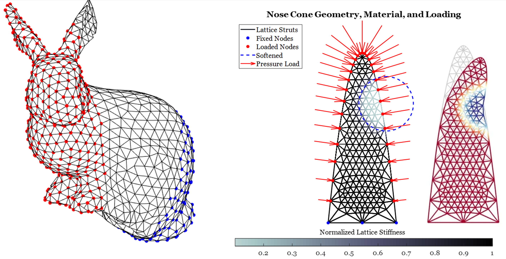

This code performs static structural analysis using the linear direct stiffness method. The code accepts mesh information (nodal coordinates; nodal connectivity) stored in a particular format: Matlab triangulation structures. 

This imposes some limitiations on nodal connectivity but allows for easy data handling and plotting.

The solver LDS_Solver.m works equally well with 2D and 3D triangulations. Users can optionally define which nodes are fixed, loaded, and the direction of those loads.

Plotting commands in the _runme script use Kevin Moerman's excellent [GibbonCode](https://www.gibboncode.org/) package, which is indispensable for image and geometry processing and visualization.
