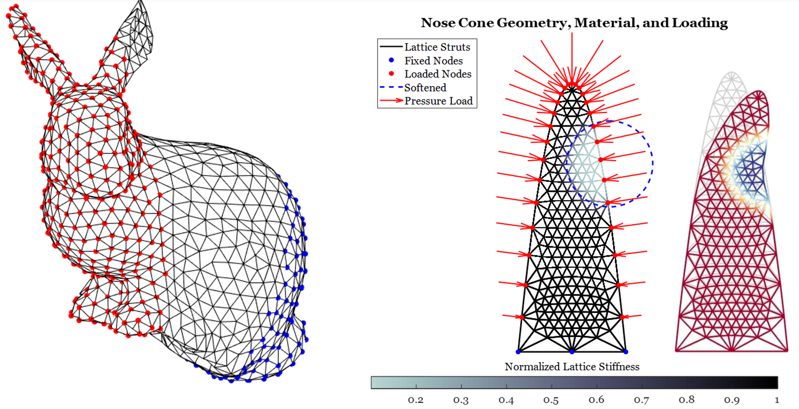

# LDS_nd

Static structural analysis by the linear direct stiffness method, in 2D and 3D.



The code takes mesh information (nodal coordinates and nodal connectivity) as a
MATLAB `triangulation` object. Every edge of the triangulation becomes a
structural member. This constrains what connectivity you can express, but it
makes data handling and plotting easy, and it means the same solver works on a
2D triangulation and a 3D tetrahedralization without modification.

## Getting started

```matlab
setupLDS            % once per session: puts src/, demos/ and input_meshes/ on the path
DEMO_Cantilever     % or any other demo
```

`setupLDS` is what makes the demos independent of your working directory. It
does **not** install the external dependencies listed below.

## Layout

| Path | Contents |
| --- | --- |
| `src/` | Solvers and plotting helpers |
| `demos/` | Runnable `DEMO_*` scripts |
| `input_meshes/` | Saved `triangulation` objects used by the demos |

### Solvers

- **`src/LDS_Bar_Solver.m`** — axial bar (truss) elements, 2D or 3D. Self
  contained, vectorized sparse assembly, no external dependencies. Returns
  nodal displacements and a scalar compliance.
- **`src/LDS_Beam_Solver.m`** — beam elements, which carry bending and torsion
  in addition to axial load. A thin wrapper around the `MSA` package (see
  dependencies).

Both solvers take optional arguments for per-element material properties and
for which nodes are fixed and loaded; see the header comments in each file.

### Helpers

- **`src/barLocalStiffness.m`** — unit local stiffness matrix and length of a
  single bar element. Scale by `EA/L` for the physical element stiffness.
- **`src/rhoPlot.m`** — draw a lattice coloured by per-element density.
- **`src/deformedStressPlot.m`** — draw the deformed lattice coloured by
  per-element axial force (2D only).

### Demos

| Demo | What it shows |
| --- | --- |
| `DEMO_Cantilever` | Bar solver on a randomized cantilever mesh |
| `DEMO_BunnyBars` | Bar solver on a 2D/3D bunny mesh |
| `DEMO_SIMP` | Compliance-minimizing topology optimization (SIMP + optimality criteria) |
| `DEMO_Top_Opt` | Heuristic stress-driven density update, for contrast with SIMP |
| `DEMO_MorphingWingBeams` | Beam elements on a pressure-loaded nose cone with a locally softened region |

## Dependencies

The solver core (`LDS_Bar_Solver`, `barLocalStiffness`) needs only base MATLAB.
The demos and plotting helpers need:

- **[GIBBON](https://www.gibboncode.org/)** — Kevin Moerman's geometry and
  visualization toolbox. Provides `cFigure`, `plotV`, `axisGeom`, `gdrawnow`,
  `evenlySampleCurve`, `regionTriMesh2D`, `regionTriMeshRand2D`, `vecnormalize`.
- **[brewermap](https://www.mathworks.com/matlabcentral/fileexchange/45208)** —
  ColorBrewer colormaps, used by every plotting helper.
- **[MSA](https://www.mathworks.com/matlabcentral/fileexchange/27012-matrix-structural-analysis)** —
  matrix structural analysis. Required only by `LDS_Beam_Solver` and
  `DEMO_MorphingWingBeams`.

## Author

Lawrence Smith | lasm4254@colorado.edu
